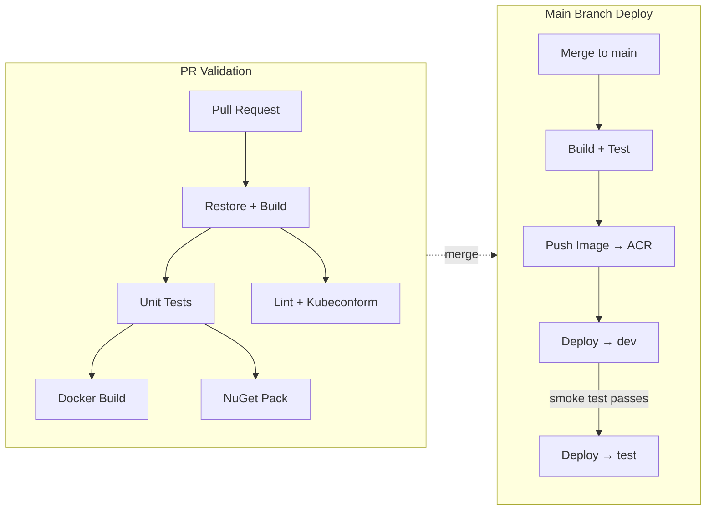

# SRE Take-Home Assessment — Adedayo Aneke

## Overview

CI/CD pipeline for a .NET 10 API deployed to AKS via GitHub Actions, with Kustomize-managed Kubernetes manifests and environment promotion from development to test.



## Repository Structure

```
.github/workflows/
  pr.yml                    # CI — build, test, Docker build, lint
  main.yml                  # CD — build, push ACR, deploy dev → test
  contracts-release.yml     # NuGet release on tag

deploy/
  base/                     # Shared K8s manifests (Kustomize base)
    deployment.yaml         # 2 replicas, probes, security context
    service.yaml            # ClusterIP on port 80
    hpa.yaml                # CPU-based autoscaler (2–6 replicas)
    pdb.yaml                # minAvailable: 1
    networkpolicy.yaml      # Ingress from nginx, egress to DNS + HTTPS
    serviceaccount.yaml     # Dedicated SA, ready for Workload Identity
    kustomization.yaml
  overlays/
    dev/                    # namespace: candidate-api-dev
    test/                   # namespace: candidate-api-test

src/CandidateApi/
  Dockerfile                # Multi-stage, chiseled, non-root

docs/
  ARCHITECTURE.md           # Decision record and trade-off analysis
  VALIDATION.md             # Step-by-step reviewer walkthrough
  RUNBOOK.md                # Incident response procedures
```

## Quick Start (Local)

```bash
# Prerequisites: .NET 10 SDK, Docker

# Build and test
make build
make test

# Run locally
make run
# → http://localhost:5000/health/ready

# Docker
make docker-build
make docker-run
# → http://localhost:8080/health/ready

# Validate K8s manifests
make lint
```

## Pipeline Architecture

### PR Workflow (`pr.yml`)

Triggers on pull requests to `main`. Three parallel jobs:

1. **Build & Test** — restores, builds, runs xunit tests with coverage, packs Contracts NuGet
2. **Docker Build** — validates the Dockerfile builds successfully (no push)
3. **Lint & Validate** — Hadolint on Dockerfile, kubeconform on rendered manifests

Test results are posted as PR comments via `dorny/test-reporter`.

### Main Workflow (`main.yml`)

Triggers on push to `main`. Sequential pipeline:

1. **Build & Test** — same as PR, plus pushes Contracts NuGet to GitHub Packages
2. **Publish Image** — builds and pushes to ACR with SHA + latest tags
3. **Deploy to Dev** — Kustomize overlay → `kubectl apply`, rollout status, smoke test
4. **Deploy to Test** — auto-promotes after dev smoke test passes

### Contracts Release (`contracts-release.yml`)

Triggers on `contracts-v*` tags. Packs and publishes to GitHub Packages with the version from the tag.

## Secrets & Configuration

All authentication uses **GitHub OIDC federation** — no long-lived service principal secrets.

### Required Secrets

| Secret                   | Purpose                              |
|--------------------------|--------------------------------------|
| `AZURE_CLIENT_ID`        | App registration for OIDC federation |
| `AZURE_TENANT_ID`        | Azure AD tenant                      |
| `AZURE_SUBSCRIPTION_ID`  | Target Azure subscription            |

### Required Variables

| Variable                 | Purpose                              |
|--------------------------|--------------------------------------|
| `ACR_NAME`               | ACR name (without `.azurecr.io`)     |

### Environment Secrets (per GitHub Environment)

| Secret                   | Purpose                              |
|--------------------------|--------------------------------------|
| `AKS_CLUSTER_NAME`       | AKS cluster name                     |
| `AKS_RESOURCE_GROUP`     | Resource group containing the cluster|

### Setting Up OIDC Federation

```bash
# 1. Create an Azure AD app registration
az ad app create --display-name "github-sre-take-home"

# 2. Add federated credential for the main branch
az ad app federated-credential create \
  --id <APP_OBJECT_ID> \
  --parameters '{
    "name": "github-main",
    "issuer": "https://token.actions.githubusercontent.com",
    "subject": "repo:kaiserdayo/sre-take-home:ref:refs/heads/main",
    "audiences": ["api://AzureADTokenExchange"]
  }'

# 3. Grant the app Contributor + AcrPush roles
az role assignment create --assignee <APP_CLIENT_ID> \
  --role Contributor --scope /subscriptions/<SUB_ID>
az role assignment create --assignee <APP_CLIENT_ID> \
  --role AcrPush --scope /subscriptions/<SUB_ID>/resourceGroups/<RG>/providers/Microsoft.ContainerRegistry/registries/<ACR>

# 4. Attach ACR to AKS for image pull
az aks update -n <CLUSTER> -g <RG> --attach-acr <ACR>
```

## Further Reading

- [Architecture & Trade-offs](docs/ARCHITECTURE.md)
- [Reviewer Validation Guide](docs/VALIDATION.md)
- [Operational Runbook](docs/RUNBOOK.md)
